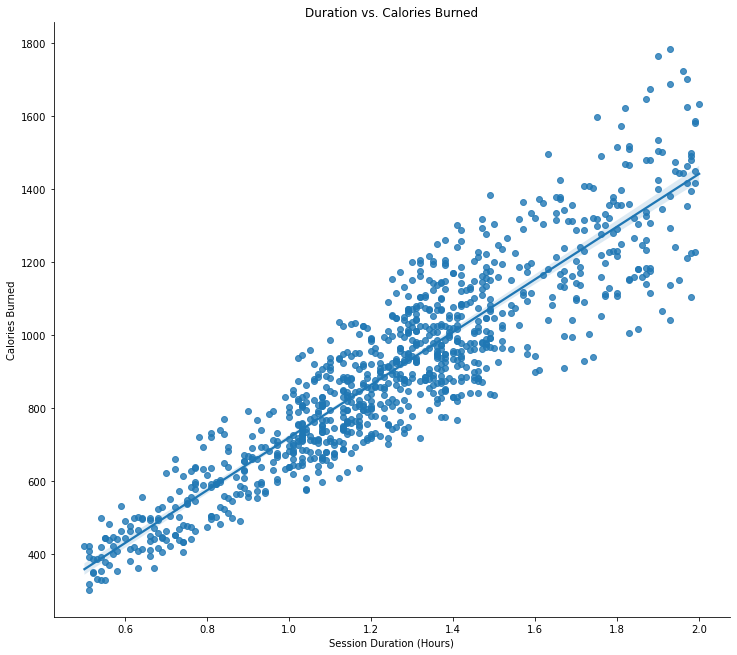
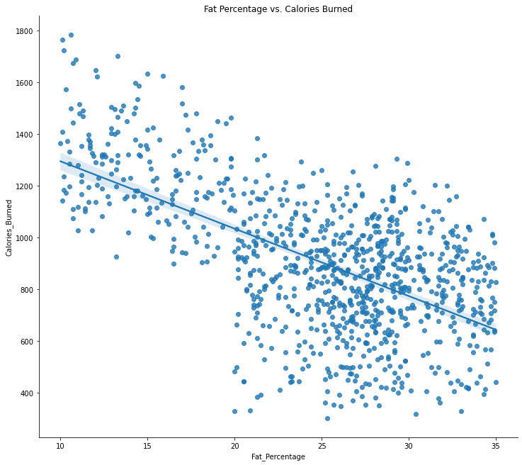

# Calories Burned Analysis and Predictions

## EDA Anlaysis
Link to original Kaggle Dataset: https://www.kaggle.com/datasets/valakhorasani/gym-members-exercise-dataset

This dataset gives an overview of gym members exercise routines, physical attributes, and caloric burn metrics. There are 973 workout entries each with a number of calories burned and the physical attributes fo the participant.

There is a very strong correclation between session duration and calories burned as shown below.

 

There is also a very large increase in the number of calories burned and the experience level of the partricipant as seen below. Level 3 participants minimum calories burned is very near the median and mean of the level 2 number of calories burned. This makes sense as the higher experience level participants have the higher average session duration. 

The session duration, experience level, and fat percentage are the strongest correlated features when it comes to predicting calories burned. 

 
 
 

For modeling all catorgical variables will be one-hot encoded to be correctly consumed by the model.

## Initial Linear Model
My initial model will be a linear regression to set a baseline result. All categorical variables are encoded and numberical variables have been standardized. 

Inital finding is that a linear model does very well at predicting calories burned. The initial run was done with a 20% hold out for a testing dataset. The linear model achieved an R2 score of .9803 and a MAE of 30.27. Meaning the actual and predicted values of our target column, calories burned, are very correlated with each other. And on average the linear model is off by 30 calories per prediciton.  

The residuals analysis was also very promising. The residuals plot show a good scatter around the zero line showing good linearity within the model. There is no correlation shown in the data as well showing independence of the features.  

## Random Forest Regressor
The more complicated model I chose was a random forest regressor model. The data is the same as used in the previous model with encoding and standardization. 

The random forest did very well at predicting the caloric burn, but was not as good as the initial linear model. The forest achieved an R2 score of .9231 which is slightly lower than the linear .98. The forest MAE was also higher at 62 meaning on average the random forest model is off by 62 calories per prediction, almost double the linear model. 

 

The random forest model may have done worse for a variety fo reasons. My data has a good linear relationship between some of the features and the target variable which is most likely why the linear model beat the random forest. Another factor may be the data size. There are ony 973 data points to work with in this set. The random forest might need more data t be able to out class the linear model. 